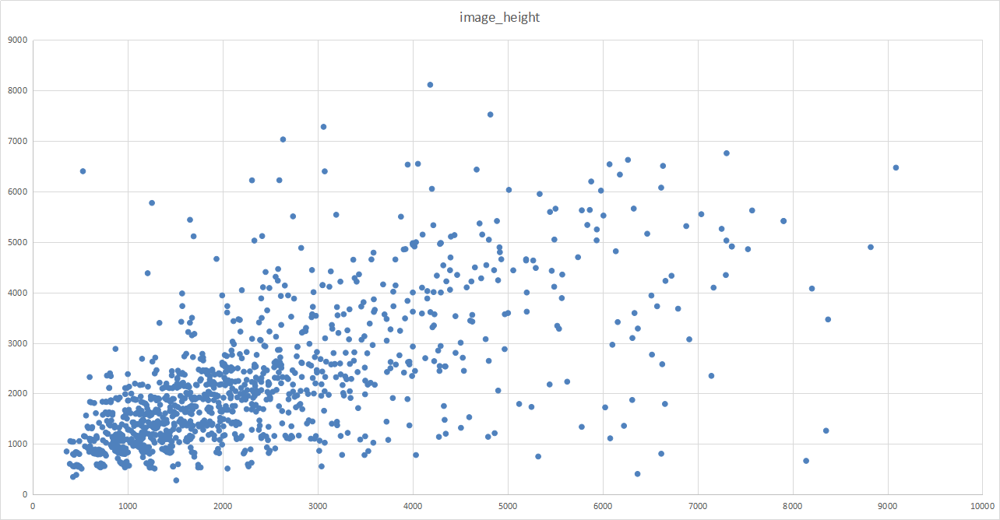

# Data_Analysis

## 问题
- 标签怎么划分 (18类)
- 怎么划分，用不用 Word Tree
- difficult 是否用于标签 
## 待处理
- 类别数量统计，图片长、宽、长宽比，目标尺度的统计，类别的统计 
- OHEM 商汤Pytouch MMdetection MMLAB
## 数据增强
## 黑边 暂时不处理

# PS
* Kaggle 暂时没找到太好的
* 知乎上有个论文截图 （在此markdown相同目录）

# 比赛数据分析

## 图片数量

集合 | 图片数量 | 框总数 | 平均每张图片框的个数
---|---|---|---
train | 1830 | 268627 | 146
val  | 593 | 81048 | 136
test  | 783

## Google Earth 来源的散点图（去掉了几个个特别大的离群点）
P11054 
P2959
P3536
P4544
P4876
P5203
P5789
P6637
P6688
P6905
P8137
P9732
P9847

离群点全部是高分图像

